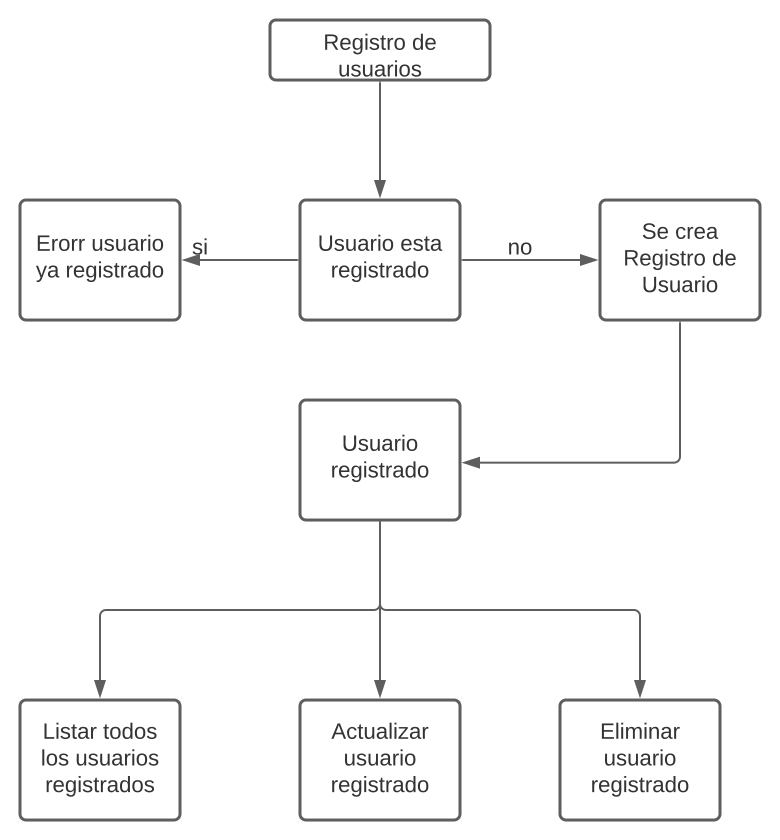

## Challenge.sebastian.orellana
This is a technical challenge for the BCI bank

## User Registry creation Api
This is a microservice application to be part of a microservice architecture.

This application is configured to was generated to add, update, modify user records.

## Functional Description
### Context
The API provides the creation of users, This API allows you to perform the following functions:

- User Registration
- Update of a registered user
- List all registered users
- Delete any registered user

#### Development Stack
- h2 data base
- Springboot with build Gradle
- Persistence with Hibernate
- Tomcat server
- Java 8
- Junit 
- Token JWT
- spring boot security


## API Documentation
The api operations are as follows

### API Resources / Operations

 
#### <span style="color: #61affe">POST</span> /api/register <small style="color: #3b4151">User Registration</small>

```http
  POST /api/register
```

#### Request

```typescript
{
    "name": "22101121231230",
    "email": "Sebastian@gmail.com",
    "password": "Aasd12",
    "modified": null,
    "active": true,
    "phones": [
        {
            "number": 1234567,
            "cityCode": 1,
            "contryCode": 57
        },
        {
            "number": 1234568,
            "cityCode": 3,
            "contryCode": 57
        }
    ]
}
```
 
 
 #### <span style="color: #61affe">POST</span> /api/login <small style="color: #3b4151">User Login</small>
 
 ```http
   POST /api/login
 ```
 
 #### Request
 
 ```typescript
 {
     "username": "sorellana12@gmail.com",
     "password": "Aasd12"
 }
 ```

 
 
 
 
 
 
 
  #### <span style="color: #61affe">GET</span> /user/list <small style="color: #3b4151">List all registered users</small>

```http
  GET /api/user/list
```

#### <span style="color: #61affe">PUT</span> /user/list <small style="color: #3b4151">Update of a registered user</small>

```http
  PUT /api/user/{email}
```

#### Request

```typescript
{
    "name": "c9",
    "email": "c4@gmail.com",
    "password": "Asd12",
    "active": true,
    "phones": [
        {
            "number": 1234567,
            "cityCode": 1,
            "contryCode": 57
        },
        {
            "number": 1234568,
            "cityCode": 3,
            "contryCode": 57
        }
    ]
}
```


#### <span style="color: #61affe">DELETE</span> /user/list <small style="color: #3b4151">Delete any registered user</small>

```http
  DELETE /api/user/{email}
```

### solution diagram




### Postman 

```typescript
{
	"info": {
		"_postman_id": "e2334aa6-9867-4e0c-8517-a60aec4dae06",
		"name": "Challange BCI",
		"schema": "https://schema.getpostman.com/json/collection/v2.1.0/collection.json"
	},
	"item": [
		{
			"name": "Registrar Usuario Anon",
			"event": [
				{
					"listen": "test",
					"script": {
						"exec": [
							"pm.test(\"Registrar Usuario\", function () {\r",
							"    var data = pm.response.json();\r",
							"    pm.expect(data.email).to.be.not.null;\r",
							"    pm.expect(data.password).to.be.not.null;\r",
							"    pm.globals.set(\"gb_user_email\", data.email);\r",
							"    pm.globals.set(\"gb_user_password\", data.email);    \r",
							"});"
						],
						"type": "text/javascript"
					}
				}
			],
			"request": {
				"method": "POST",
				"header": [
					{
						"key": "Content-Type",
						"value": "application/json"
					}
				],
				"body": {
					"mode": "raw",
					"raw": "{\n    \"name\": \"22101121231230\",\n    \"email\": \"sorellana12@gmail.com\",\n    \"password\": \"Aasd12\",\n    \"modified\": null,\n    \"active\": true,\n    \"phones\": [\n        {\n            \"number\": 1234567,\n            \"cityCode\": 1,\n            \"contryCode\": 57\n        },\n        {\n            \"number\": 1234568,\n            \"cityCode\": 3,\n            \"contryCode\": 57\n        }\n    ]\n}"
				},
				"url": {
					"raw": "http://localhost:8888/api/register",
					"protocol": "http",
					"host": [
						"localhost"
					],
					"port": "8888",
					"path": [
						"api",
						"register"
					]
				}
			},
			"response": []
		},
		{
			"name": "Autenticar usuario",
			"event": [
				{
					"listen": "test",
					"script": {
						"exec": [
							"pm.test(\"Token\", function () {\r",
							"    var data = pm.response.json();\r",
							"    pm.expect(data.token).to.be.not.null;\r",
							"    pm.globals.set(\"access_token\", data.token);    \r",
							"});"
						],
						"type": "text/javascript"
					}
				}
			],
			"request": {
				"method": "POST",
				"header": [
					{
						"key": "Content-Type",
						"value": "application/json",
						"type": "text"
					}
				],
				"body": {
					"mode": "raw",
					"raw": "{\r\n    \"username\": \"sorellana12@gmail.com\",\r\n    \"password\": \"Aasd12\"\r\n}"
				},
				"url": {
					"raw": "http://localhost:8888/api/login",
					"protocol": "http",
					"host": [
						"localhost"
					],
					"port": "8888",
					"path": [
						"api",
						"login"
					]
				}
			},
			"response": []
		},
		{
			"name": "Listar Usuarios Autenticado",
			"protocolProfileBehavior": {
				"disableBodyPruning": true
			},
			"request": {
				"auth": {
					"type": "bearer",
					"bearer": [
						{
							"key": "token",
							"value": "{{access_token}}",
							"type": "string"
						}
					]
				},
				"method": "GET",
				"header": [
					{
						"key": "Content-Type",
						"value": "application/json"
					}
				],
				"body": {
					"mode": "raw",
					"raw": ""
				},
				"url": {
					"raw": "http://localhost:8888/api/user/list",
					"protocol": "http",
					"host": [
						"localhost"
					],
					"port": "8888",
					"path": [
						"api",
						"user",
						"list"
					]
				}
			},
			"response": []
		},
		{
			"name": "Actualizar Usuario Autenticado Copy",
			"request": {
				"auth": {
					"type": "bearer",
					"bearer": [
						{
							"key": "token",
							"value": "{{access_token}}",
							"type": "string"
						}
					]
				},
				"method": "PUT",
				"header": [
					{
						"key": "Content-Type",
						"value": "application/json"
					}
				],
				"body": {
					"mode": "raw",
					"raw": "{\n    \"name\": \"c9\",\n    \"email\": \"sorellana12@gmail.com\",\n    \"password\": \"Aasdasdasdasasdasdasd23\",\n    \"active\": true,\n    \"phones\": [\n        {\n            \"number\": 1234567,\n            \"cityCode\": 1,\n            \"contryCode\": 57\n        },\n        {\n            \"number\": 1234568,\n            \"cityCode\": 3,\n            \"contryCode\": 57\n        }\n    ]\n}"
				},
				"url": {
					"raw": "http://localhost:8888/api/user/sorellana12@gmail.com",
					"protocol": "http",
					"host": [
						"localhost"
					],
					"port": "8888",
					"path": [
						"api",
						"user",
						"sorellana12@gmail.com"
					]
				}
			},
			"response": []
		},
		{
			"name": "Eliminar Usuario Autenticado",
			"request": {
				"auth": {
					"type": "bearer",
					"bearer": [
						{
							"key": "token",
							"value": "{{access_token}}",
							"type": "string"
						}
					]
				},
				"method": "DELETE",
				"header": [
					{
						"key": "Content-Type",
						"value": "application/json"
					}
				],
				"url": {
					"raw": "http://localhost:8888/api/user/sorellana12@gmail.com",
					"protocol": "http",
					"host": [
						"localhost"
					],
					"port": "8888",
					"path": [
						"api",
						"user",
						"sorellana12@gmail.com"
					]
				}
			},
			"response": []
		}
	]
}
```